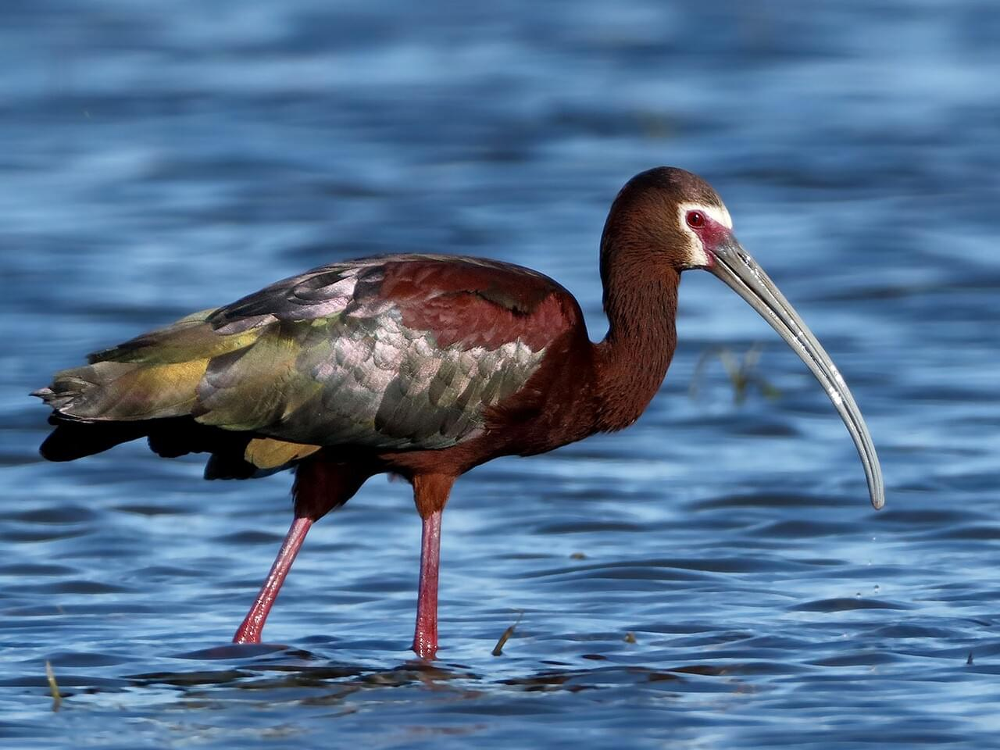
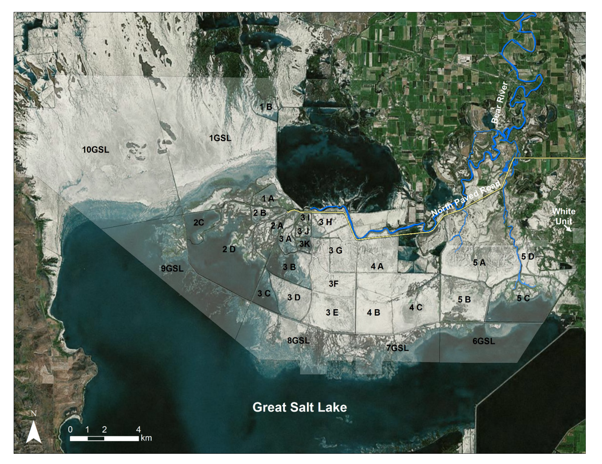

```{r}
#| message: false
library(tidyverse) 
library(janitor)
library(leaflet)
library(leafem)
library(rnaturalearth)
library(sf)
library(terra)
library(igraph)
library(imager)
library(shiny)
library(bslib)
#load and clean data
nest_data_rough <- read.csv("C:/Users/apbb0/OneDrive - Montana State University/STAT408/Project/STAT408_Project_Buddin/wfib.ns.data_data_release.csv")
nest_data = nest_data_rough|>
  clean_names()|>
  mutate(row_id = row_number(), .before = "unique_nest_id")
#Create new dataframe for graphs that groups and summarizes data by nest site.
nest_by_site = nest_data|>
  group_by(nest_site)|>
  summarize(
    mean_clutch = mean(full_clutch_size, na.rm = TRUE),
    mean_height = mean(avg_veg_height, na.rm = TRUE),
    mean_cover = mean(veg_percent_vegetation, na.rm = TRUE),
    mean_survive = mean(survive_full, na.rm = TRUE),
    mean_depth = mean(water_depth, na.rm = TRUE)
  )
  


```

```{r}
#| output: false


# #load band 4 raster
# veg_B04 = rast("C:/Users/apbb0/OneDrive - Montana State University/STAT408/Project/STAT408_Project_Buddin/HLS.L30.T12TUL.2023140T180705.v2.0.B04.tif")
# #reproject raster
# #veg_B04 = project(veg_B04, "EPSG:4326")
# #set bounds based on shp
# raster_bounds = vect("C:/Users/apbb0/OneDrive - Montana State University/STAT408/Project/STAT408_Project_Buddin/BRVMBR_bounds.shp")
# raster_bounds = project(raster_bounds, crs(veg_B04))
# #clip raster to shp extent
# veg_B04_clip = mask(crop(veg_B04, raster_bounds), raster_bounds)
# writeRaster(
#   veg_B04_clip,
#   filename = "veg_B04_clip.tif",
#   overwrite = TRUE,
#   gdal = c("COMPRESS=LZW")
# )
# 
# #load band 5 raster
# veg_B05 = rast("C:/Users/apbb0/OneDrive - Montana State University/STAT408/Project/STAT408_Project_Buddin/HLS.L30.T12TUL.2023140T180705.v2.0.B05.tif")
# #reproject raster
# #veg_B05 = project(veg_B05, "EPSG:4326")
# #clip raster to shp extent
# veg_B05_clip = mask(crop(veg_B05, raster_bounds), raster_bounds)
# writeRaster(
#   veg_B05_clip,
#   filename = "veg_B05_clip.tif",
#   overwrite = TRUE,
#   gdal = c("COMPRESS=LZW")
#)


# I had to comment out the above code because the file size was too large

#turning the clipped imagery into a spat raster
veg_B04_clip <- rast("veg_B04_clip.tif")
veg_B05_clip <- rast("veg_B05_clip.tif")
#getting rid of Values below zero(Nan)
veg_B04_clip[veg_B04_clip <= 0] <- NA
veg_B05_clip[veg_B05_clip <= 0] <- NA
#calcualting NDVI raster
ndvi <- (veg_B05_clip - veg_B04_clip) / (veg_B05_clip + veg_B04_clip)
#saving ndvi to its own .tif
tmpfile <- tempfile(fileext = ".tif")
writeRaster(ndvi, tmpfile, overwrite = TRUE)


```

# Overview

Vegetation analysis of nesting habitat for birds can be used to create distribution models and predicting nesting locations. I will be using nesting data for White-faced ibis (*Plegadis chihi*) in the Bear River Migratory Bird Refuge in Great Salt Lake, UT, and NDVIs derived from Landsat 8 satellite imagery. This analysis will include a vegetation height map, a normalized difference vegetation index (NDVI) map, and charts and graphs showing the relationship and distribution of nests in each site. The nesting data was collected by Ackerman and Herzog in 2012 through the Western Ecological Research Center and USGS, and their analysis was published in the *The Wilson Journal of Ornithology*.

## Row {height = 40%}

```{r}
#| title: "The White-faced Ibis (*Plegadis chihi*)"

```
```{r}
#| title: "Map of Bear River Migratory Bird Refuge. This study focuses on Site 1, 2, and 3 (Ackerman et al., 2015)"

```

# Graphs and Nest Analysis

## Row {height = 30%}


```{r}

# nrow(nest_data)
# sum(nest_data$survive_full)/nrow(nest_data)
# mean(nest_data$full_clutch_size)
# mean(nest_data$estimated_nest_age)

card(
  class = "bg-success text-white",
  card_header("Nest Survival Rate"),
  "56.2%"
)
card(
  class = "bg-primary text-white",  
  card_header("Average Clutch Size"),
  "3.2"
)
card(
  class = "bg-danger text-white",
  card_header("Average Nest Age"),
  "11.5 Days"
)
```

## Row {.tabset}

### Vegetation Height

```{r}
#basic graph showing Relationship between vegetation height and cover


# nest_data_by_veg = nest_data|>
#   group_by(veg_percent_vegetation)|>
#   mutate(
#     survive_count = sum(survive_full)
#   )
# scale_factor = mean(nest_data$avg_veg_height)/mean(nest_data$survive_count)
# 
# ggplot(data= nest_data_by_veg, aes(x = veg_percent_vegetation)) +
# geom_point(aes(y = avg_veg_height))+
# geom_line(aes(y = survive_count*scale_factor))+
# scale_y_continuous(
#   name = "Average Vegetation Height (cm)",
#   sec.axis = sec_axis(~./scale_factor, name = "Number of Nest Successes")
# )+
#   labs(
#     title = ""
#   )


  

ggplot(data = nest_by_site, aes(x = nest_site, y = mean_height, fill = nest_site))+
  geom_col()+
    scale_fill_manual(name = "Nest Site",
    values = c(
    "lightgreen",
    "lightblue",
    "blue"
   
  ))+
  labs(
    x = "Nesting Site",
    y = "Mean Vegetation Height",
    title = "Average Vegetation Height Across 3 Sampling Sites"
    
  )+
  theme(
    plot.title = element_text(hjust = 0.5, face = "bold", color = "black"),
    panel.background = element_rect(fill ="ivory"),
    plot.background = element_rect(fill ="ivory"),
    axis.title.y = element_text(colour = "black"),
    axis.title.x = element_text(colour = "black"),
    axis.text = element_text(colour = "black"),
    axis.ticks = element_line(colour = "black"),
    panel.border = element_rect(colour = "black", fill = NA, linewidth = 0.8)
  )


```
### Vegetation Cover
```{r}
ggplot(
  data = nest_by_site,
  aes(x = nest_site, y = mean_cover, fill = nest_site))+
  geom_col()+
  scale_fill_manual(name = "Nest Site",
    values = c(
    "lightgreen",
    "lightblue",
    "blue"
    ))+ 
  labs(
    x = "Nesting Site",
    y = "Mean % Vegetation Cover",
    title = "Average Vegetation Cover Across the 3 Sites"
  )+
    
  theme(
    plot.title = element_text(hjust = 0.5, face = "bold", color = "black"),
    panel.background = element_rect(fill ="ivory"),
    plot.background = element_rect(fill ="ivory"),
    axis.title.y = element_text(colour = "black"),
    axis.title.x = element_text(colour = "black"),
    axis.text = element_text(colour = "black"),
    axis.ticks = element_line(colour = "black"),
    panel.border = element_rect(colour = "black", fill = NA, linewidth = 0.8)
  )
```
### Water Depth
```{r}
ggplot(
  data = nest_by_site,
  aes(x = nest_site, y = mean_depth, fill = nest_site))+
  geom_col()+
  scale_fill_manual(name = "Nest Site",
    values = c(
    "lightgreen",
    "lightblue",
    "blue"
    ))+ 
  labs(
    x = "Nesting Site",
    y = "Mean Water Depth",
    title = "Average Water Depth Across the 3 Sites"
  )+
    
  theme(
    plot.title = element_text(hjust = 0.5, face = "bold", color = "black"),
    panel.background = element_rect(fill ="ivory"),
    plot.background = element_rect(fill ="ivory"),
    axis.title.y = element_text(colour = "black"),
    axis.title.x = element_text(colour = "black"),
    axis.text = element_text(colour = "black"),
    axis.ticks = element_line(colour = "black"),
    panel.border = element_rect(colour = "black", fill = NA, linewidth = 0.8)
  )
```

# NDVI 

A Normalized Difference Vegetation Index uses Landsat 8 imagery and finds the differences between the Red and NIR bands in the raster. Values range from -1 to 1, with higher values indicating healthy vegetation. In this map, you can see areas within each study area that have healthy vegetation, and this is where the nesting sites are located. The imagery data is from June of 2014, as the collection of imagery does not date back to the study year, 2012.

```{r}
#| title: "NDVI overlayed on top of satellite imagery of the Bear River Migratory Bird Refuge"
# map wiht ndvi raster
#| fig-width: 14
#| fig-height: 18
map <- leaflet() %>% 
  addTiles()%>%
  addProviderTiles("Esri.WorldImagery")%>%
  addRasterImage(ndvi)%>%
    setView(lat = 41.43222, lng = -112.27, zoom = 11.5)
map
```

# Disscussion

The NDVI shows that nest site locations are correlated with healthier vegetation. This makes sense, because the ibis need vegetative cover in order to protect their nests form predators and the environment. Between the sites, site 3 had the deepest water and least vegetation, which is reflected in the NDVI map, which shows areas of low productivity(water has low NDVI values). I originally wanted to plot the nesting samples on the map, but their location was not listed in the data set or any paper about the topic in order to protect the nesting habitat of the birds. This analysis is useful for future work modeling where ibis prefer to nest, and with specific locations of nest sites or quadrants, I could have run a model that could be applied to other locations to predict nesting locations without field sampling. These models could be used to make decisions on where to sample, and predict where colonies of ibis might be nesting in a previously undocumented area. 


The nesting data was published in the *Wilson Journal of Ornithology*, and the authors have also conducted anaylsis on the effect of heavy metals on nesting species in the same refuge. The White-faced ibis can be found in Bozeman in the summer breeding season, so make sure to look out for it this summer!

First 50 rows of the nesting data:

```{r}
head(nest_data, 50)
```

Citations:


Ackerman JT, Herzog MP, Hartman CA, Isanhart J, HerringG, et al. 2015b. Mercury and selenium contaminationin waterbird eggs and risk to avian reproduction atGreat Salt Lake, Utah. U.S. Geological Survey Open-File Report 2015–1020.

Herzog, M. P., J. T. Ackerman, C. A. Hartman, and H. Browers. 2020. Nesting ecology of White-faced Ibis (Plegadis chihi) in Great Salt Lake, Utah. The Wilson Journal of Ornithology 132:134–144.

White-faced Ibis Overview, All About Birds, Cornell Lab of Ornithology. n.d. <https://www.allaboutbirds.org/guide/White-faced_Ibis/overview>. Accessed 6 May 2026.


